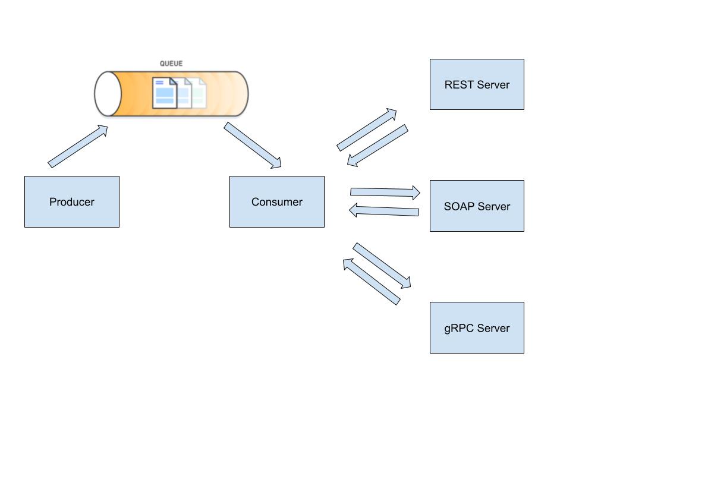

# Distributed Process Communication
This project implements middleware abstractions needed for processes communication in JAVA, by exchanging simple messages through a message broker (JMS ActiveMQ), the following figure illustrates how the communication between the processes is done.

Packaging for processes deployment is managed using Maven. 

  
   

